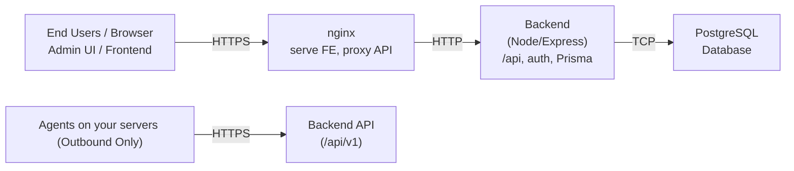

# PatchMon - Linux Patch Monitoring made Simple

[](https://patchmon.net)
[](https://patchmon.net/discord)
[](https://github.com/9technologygroup/patchmon.net)
[](https://github.com/users/9technologygroup/projects/1)
[](https://docs.patchmon.net/)

---

## Please STAR this repo :D

## Purpose

PatchMon provides centralized patch management across diverse server environments. Agents communicate outbound-only to the PatchMon server, eliminating inbound ports on monitored hosts while delivering comprehensive visibility and safe automation.


## Features

### Dashboard
- Customisable dashboard with per‑user card layout and ordering

### Users & Authentication
- Multi-user accounts (admin and standard users)
- Roles, Permissions & RBAC

### Hosts & Inventory
- Host inventory/groups with key attributes and OS details
- Host grouping (create and manage host groups)

### Packages & Updates
- Package inventory across hosts
- Outdated packages overview and counts
- Repositories per host tracking

### Agent & Data Collection
- Agent version management and script content stored in DB

### Settings & Configuration
- Server URL/protocol/host/port
- Signup toggle and default user role selection

### API & Integrations
- REST API under `/api/v1` with JWT auth
- Proxmox LXC Auto-Enrollment - Automatically discover and enroll LXC containers from Proxmox hosts

### Security
- Rate limiting for general, auth, and agent endpoints
- Outbound‑only agent model reduces attack surface

### Security Compliance
- **OpenSCAP** - CIS Benchmarks for Linux hosts (Ubuntu, Debian, RHEL, CentOS, Rocky)
- **Docker Bench for Security** - CIS Docker Benchmark for container security
- Automated scheduled scans (configurable interval)
- On-demand scan triggering from dashboard
- Compliance score tracking over time
- Detailed rule-level results with remediation guidance
- Dashboard with fleet-wide compliance overview

See [Security Compliance Installation Guide](docs/security-compliance/INSTALLATION.md) for setup instructions.

| Environment Variable | Default | Description |
|---------------------|---------|-------------|
| `COMPLIANCE_SCAN_INTERVAL` | `86400` | Seconds between scheduled scans |
| `COMPLIANCE_ENABLED` | `true` | Enable/disable compliance feature |

### Notifications & Alerting
- Gotify integration for real-time push notifications
- Flexible notification rules based on event types and host filters
- Notification history and delivery tracking
- Support for multiple Gotify instances

### Deployment & Operations
- Docker installation & One‑line self‑host installer (Ubuntu/Debian)
- systemd service for backend lifecycle
- nginx vhost for frontend + API proxy; optional Let’s Encrypt integration


## Getting Started

### PatchMon Cloud (coming soon)

Managed, zero-maintenance PatchMon hosting. Stay tuned.

### Self-hosted Installation

#### Docker (preferred)

For getting started with Docker, see the [Docker documentation](https://github.com/PatchMon/PatchMon/blob/main/docker/README.md)

#### Native Install (advanced/non-docker)

Run on a clean Ubuntu/Debian server with internet access:

#### Debian:
```bash
apt update -y
apt upgrade -y
apt install curl -y
```

#### Ubuntu:
```bash
apt-get update -y
apt-get upgrade -y
apt install curl -y
```

#### Install Script
```bash
curl -fsSL -o setup.sh https://raw.githubusercontent.com/PatchMon/PatchMon/refs/heads/main/setup.sh && chmod +x setup.sh && bash setup.sh
```

#### Update Script (--update flag)
```bash
curl -fsSL -o setup.sh https://raw.githubusercontent.com/PatchMon/PatchMon/refs/heads/main/setup.sh && chmod +x setup.sh && bash setup.sh --update
```

#### Minimum specs for building : #####
CPU : 2 vCPU
RAM : 2GB
Disk : 15GB

During setup you’ll be asked:
- Domain/IP: public DNS or local IP (default: `patchmon.internal`)
- SSL/HTTPS: `y` for public deployments with a public IP, `n` for internal networks
- Email: only if SSL is enabled (for Let’s Encrypt)
- Git Branch: default is `main` (press Enter)

The script will:
- Install prerequisites (Node.js, PostgreSQL, nginx)
- Clone the repo, install dependencies, build the frontend, run migrations
- Create a systemd service and nginx site vhost config
- Start the service and write a consolidated info file at:
  - `/opt/<your-domain>/deployment-info.txt`
  - Copies the full installer log to `/opt/<your-domain>/patchmon-install.log` from /var/log/patchmon-install.log

After installation:
- Visit `http(s)://<your-domain>` and complete first-time admin setup
- See all useful info in `deployment-info.txt`

## Forcing updates after host package changes
Should you perform a manual package update on your host and wish to see the results reflected in PatchMon quicker than the usual scheduled update, you can trigger the process manually by running:
```bash
/usr/local/bin/patchmon-agent.sh update
```

This will send the results immediately to PatchMon.

## Gotify Notifications Configuration

PatchMon integrates with [Gotify](https://gotify.net/), a self-hosted notification service, to send real-time alerts about patch updates, security events, and system status changes.

### Prerequisites

- A running Gotify instance (self-hosted or cloud)
- Gotify application token for authentication

### Setting Up Gotify Notifications

#### 1. Create a Gotify Application

1. Log in to your Gotify instance
2. Navigate to **Apps** → **Create Application**
3. Give it a name (e.g., "PatchMon Alerts")
4. Copy the generated token

#### 2. Configure PatchMon Backend

Add the following environment variables to your backend `.env` file:

```bash
# Enable Gotify notifications
GOTIFY_NOTIFICATIONS_ENABLED=true

# Default priority for notifications (0-10, where 10 is most urgent)
GOTIFY_DEFAULT_PRIORITY=5

# Request timeout in milliseconds
GOTIFY_REQUEST_TIMEOUT_MS=10000

# Number of retry attempts for failed deliveries
GOTIFY_MAX_RETRIES=3
```

#### 3. Configure Notification Channels in PatchMon UI

1. Log in to PatchMon as an administrator
2. Navigate to **Settings** → **Notifications** → **Channels**
3. Click **Add Channel**
4. Fill in the following:
   - **Channel Name**: A descriptive name (e.g., "Production Alerts")
   - **Gotify Server URL**: Your Gotify instance URL (e.g., `https://gotify.example.com`)
   - **Application Token**: The token you copied from Gotify
5. Click **Test Connection** to verify the configuration
6. Click **Save**

#### 4. Create Notification Rules

1. Navigate to **Settings** → **Notifications** → **Rules**
2. Click **Create Rule**
3. Configure the rule:
   - **Rule Name**: A descriptive name (e.g., "Security Updates Alert")
   - **Event Type**: Select the event that triggers the notification:
     - Package Updates
     - Security Updates
     - Host Status Changes
     - Agent Updates
   - **Channels**: Select one or more Gotify channels to receive notifications
   - **Host/Group Filter**: (Optional) Limit notifications to specific hosts or groups
   - **Priority**: Set the Gotify message priority (0-10)
   - **Message Title**: Custom title for the notification
   - **Message Template**: Custom message body with event details
4. Click **Save**

#### 5. View Notification History

1. Navigate to **Settings** → **Notifications** → **History**
2. View all sent notifications with:
   - Timestamp of delivery
   - Event type that triggered the notification
   - Destination channel
   - Delivery status (sent/failed)
   - Message content
3. Use filters to search by date range, event type, channel, or status

### Message Template Variables

When creating notification rules, you can use the following variables in your message template:

- `{hostName}`: Name of the affected host
- `{eventType}`: Type of event (package-update, security-alert, etc.)
- `{packageName}`: Name of the package (for package events)
- `{packageVersion}`: Version of the package
- `{timestamp}`: Time the event occurred
- `{details}`: Additional event details

### Example Notification Rules

#### Security Updates Alert
- **Event Type**: Security Updates
- **Priority**: 10 (highest)
- **Message Title**: 🔒 Security Update Available
- **Message Template**: Security update available on {hostName}: {packageName} → {packageVersion}

#### Host Status Change
- **Event Type**: Host Status Changes
- **Priority**: 8
- **Message Title**: ⚠️ Host Status Changed
- **Message Template**: Host {hostName} status changed at {timestamp}

#### Package Updates
- **Event Type**: Package Updates
- **Priority**: 5
- **Message Title**: 📦 Package Update Available
- **Message Template**: Package update available on {hostName}: {packageName}

### Troubleshooting

#### Connection Test Fails
- Verify the Gotify server URL is correct and accessible
- Check that the application token is valid
- Ensure your firewall allows outbound connections to the Gotify server
- Check PatchMon logs for detailed error messages

#### Notifications Not Sending
- Verify the notification rule is enabled
- Check that at least one channel is selected in the rule
- Verify the event type matches the system events occurring
- Check the notification history for delivery errors
- Review PatchMon backend logs for errors

#### Notifications Delayed
- Check your Gotify server performance
- Verify network connectivity between PatchMon and Gotify
- Review the `GOTIFY_REQUEST_TIMEOUT_MS` setting if timeouts are occurring

## Communication Model

- Outbound-only agents: servers initiate communication to PatchMon
- No inbound connections required on monitored servers
- Secure server-side API with JWT authentication and rate limiting

## Architecture

- Backend: Node.js/Express + Prisma + PostgreSQL
- Frontend: Vite + React
- Reverse proxy: nginx
- Database: PostgreSQL
- System service: systemd-managed backend


Operational
- systemd manages backend service
- certbot/nginx for TLS (public)
- setup.sh bootstraps OS, app, DB, config

## Support

- Discord: [https://patchmon.net/discord](https://patchmon.net/discord)
- Email: support@patchmon.net

## Roadmap

- Roadmap board: https://github.com/orgs/PatchMon/projects/2


## License

- AGPLv3 (More information on this soon)


---

## 🤝 Contributing

We welcome contributions from the community! Here's how you can get involved:

### Development Setup
1. **Fork the Repository**
   ```bash
   # Click the "Fork" button on GitHub, then clone your fork
   git clone https://github.com/YOUR_USERNAME/patchmon.net.git
   cd patchmon.net
   ```

2. **Create a Feature Branch**
   ```bash
   git checkout -b feature/your-feature-name
   # or
   git checkout -b fix/your-bug-fix
   ```

4. **Install Dependencies and Setup Hooks**
   ```bash
   npm install
   npm run prepare
   ```

5. **Make Your Changes**
   - Write clean, well-documented code
   - Follow existing code style and patterns
   - Add tests for new functionality
   - Update documentation as needed

6. **Test Your Changes**
   ```bash
   # Run backend tests
   cd backend
   npm test
   
   # Run frontend tests
   cd ../frontend
   npm test
   ```

7. **Commit and Push**
   ```bash
   git add .
   git commit -m "Add: descriptive commit message"
   git push origin feature/your-feature-name
   ```

8. **Create a Pull Request**
   - Go to your fork on GitHub
   - Click "New Pull Request"
   - Provide a clear description of your changes
   - Link any related issues

### Contribution Guidelines
- **Code Style**: Follow the existing code patterns and Biome configuration
- **Commits**: Use conventional commit messages (feat:, fix:, docs:, etc.)
- **Testing**: Ensure all tests pass and add tests for new features
- **Documentation**: Update README and code comments as needed
- **Issues**: Check existing issues before creating new ones

---


## 🏢 Enterprise & Custom Solutions

### PatchMon Cloud
- **Fully Managed**: We handle all infrastructure and maintenance
- **Scalable**: Grows with your organization
- **Secure**: Enterprise-grade security and compliance
- **Support**: Dedicated support team

### Custom Integrations
- **API Development**: Custom endpoints for your specific needs
- **Third-Party Integrations**: Connect with your existing tools
- **Custom Dashboards**: Tailored reporting and visualization
- **White-Label Solutions**: Brand PatchMon as your own

### Enterprise Deployment
- **On-Premises**: Deploy in your own data center
- **Air-Gapped**: Support for isolated environments
- **Compliance**: Meet industry-specific requirements
- **Training**: Comprehensive team training and onboarding

*Contact us at support@patchmon.net for enterprise inquiries*

---


---

## 🙏 Acknowledgments

### Special Thanks
- **Jonathan Higson** - For inspiration, ideas, and valuable feedback
- **@Adam20054** - For working on Docker Compose deployment
- **@tigattack** - For working on GitHub CI/CD pipelines
- **Cloud X** and **Crazy Dead** - For moderating our Discord server and keeping the community awesome
- **Beta Testers** - For keeping me awake at night
- **My family** - For understanding my passion
  

### Contributors
Thank you to all our contributors who help make PatchMon better every day!


## 🔗 Links

- **Website**: [patchmon.net](https://patchmon.net)
- **Discord**: [https://patchmon.net/discord](https://patchmon.net/discord)
- **Roadmap**: [GitHub Projects](https://github.com/users/9technologygroup/projects/1)
- **Documentation**: [https://docs.patchmon.net](https://docs.patchmon.net)
- **Support**: support@patchmon.net

---

<div align="center">

**Made with ❤️ by the PatchMon Team**

[](https://patchmon.net/discord)
[](https://github.com/PatchMon/PatchMon)

</div>
