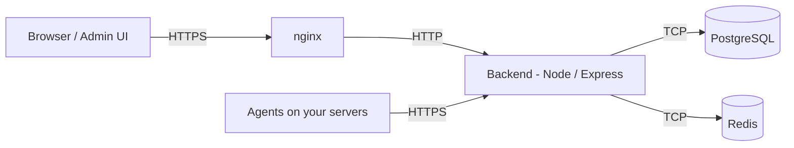

<div align="center">

# PatchMon

### Enterprise-Grade Linux & Windows Patch Monitoring & Server Management

[](https://patchmon.net)
[](https://patchmon.net)
[](https://patchmon.net/discord)
[](https://github.com/PatchMon/PatchMon)
[](https://github.com/orgs/PatchMon/projects/2)
[](https://docs.patchmon.net/)

---

This project represents hundreds of hours of development work. If PatchMon has saved you time or helped secure your infrastructure, a coffee would genuinely mean the world.

[](https://buymeacoffee.com/iby___)

</div>

---

> **⭐ If you find PatchMon useful, please star this repo - it helps others discover the project!**

## What is PatchMon?

PatchMon is an enterprise-grade platform that gives operations teams a single pane of glass to monitor, manage and secure their entire Linux and Windows fleet. Lightweight agents communicate outbound-only to the PatchMon server on your schedule - no inbound ports required on monitored hosts - delivering real-time visibility into package health, compliance posture and system status across environments of any scale.

Whether you manage ten servers or ten thousand, PatchMon provides the tooling, automation and auditability that modern infrastructure teams demand.


---

## Features at a Glance

| Category | What You Can Do |
|---|---|
| 📊 **Dashboard** | Personalised overview cards you can reorder and customise per user. See fleet health, outdated package counts and host status at a glance. |
| 🖥️ **Host Inventory** | Browse all enrolled servers with OS details, uptime, kernel version and last check-in time. Organise hosts into groups for easier management. |
| 📦 **Package Management** | View every installed package across your fleet. Quickly filter to outdated packages and see exactly which hosts need attention. |
| 🔄 **Repository Tracking** | See which APT / YUM / DNF repositories are configured on each host in one place. |
| 🐳 **Docker Monitoring** | Automatic discovery of containers, images, volumes and networks. Real-time container status updates pushed via WebSocket. |
| 🛡️ **Compliance Scanning** | Run OpenSCAP CIS Benchmarks and Docker Bench for Security scans. Track compliance scores over time with detailed rule-level results and remediation guidance. |
| 💻 **Web SSH Terminal** | Open a browser-based SSH session to any host directly from the UI - no extra tools needed. Supports direct and proxy mode (route through the agent, no SSH port exposure). |
| 🤖 **AI Terminal Assistant** | Built-in AI chat panel inside the SSH terminal. Get command suggestions, error diagnosis and context-aware help powered by OpenRouter, Anthropic, OpenAI or Google Gemini. |
| 🔔 **Alerting & Reporting** | Alerts for host-down, pending server updates and agent updates. Filter by severity, type and status; assign alerts to team members. |
| 👥 **Users, Roles & RBAC** | Multi-user accounts with fully customisable roles and granular permissions so every team member sees only what they need. |
| 🔐 **OIDC Single Sign-On** | Authenticate with Authentik, Keycloak, Okta or any OIDC provider. Supports automatic user provisioning, group-to-role mapping and SSO-only enforcement. |
| 🔑 **Two-Factor Authentication** | TOTP-based 2FA with QR-code setup and backup codes for local accounts. |
| 🎨 **Branding & Theming** | Upload custom logos and favicon. Choose from multiple colour themes and toggle between light and dark mode - per user. |
| ⚙️ **Automation Engine** | View and trigger scheduled background jobs (version checks, session cleanup, Docker inventory, host status monitor and more) from one page. |
| 🔗 **Integrations** | Proxmox LXC auto-enrolment, GetHomepage dashboard widget, scoped API credentials, and an Ansible dynamic inventory library. |
| 📡 **REST API** | Full API under `/api/v1` with JWT authentication and interactive Swagger / OpenAPI docs at `/api-docs`. |
| 🛡️ **Security by Design** | Outbound-only agent model (no inbound ports on monitored hosts), rate limiting on all endpoints, httpOnly cookie auth, and configurable IP allow-lists for enrolment tokens. |

---

## Deployment Options

### PatchMon Cloud

> **Hosted by PatchMon** at **[patchmon.net](https://patchmon.net)**

Fully managed PatchMon hosting with zero infrastructure overhead. We handle provisioning, updates, backups and scaling so you can focus on your fleet instead of the tooling behind it.

- Instant onboarding - sign up and start enrolling agents in minutes
- Automatic updates with zero-downtime deployments
- Enterprise-grade availability and security
- Dedicated support included

### Self-Hosted Installation

#### Docker (recommended)

The quickest way to get running. See the full guide on our documentation site:

👉 **[Installing PatchMon Server on Docker](https://docs.patchmon.net/books/patchmon-application-documentation/page/installing-patchmon-server-on-docker)**

**Quick start:**

```bash
# Download compose file and example env
curl -fsSL -o docker-compose.yml https://raw.githubusercontent.com/PatchMon/PatchMon/refs/heads/main/docker/docker-compose.yml
curl -fsSL -o env.example https://raw.githubusercontent.com/PatchMon/PatchMon/refs/heads/main/docker/env.example

# Create .env with generated secrets
cp env.example .env
sed -i "s/^POSTGRES_PASSWORD=$/POSTGRES_PASSWORD=$(openssl rand -hex 32)/" .env
sed -i "s/^REDIS_PASSWORD=$/REDIS_PASSWORD=$(openssl rand -hex 32)/" .env
sed -i "s/^JWT_SECRET=$/JWT_SECRET=$(openssl rand -hex 64)/" .env

# Start PatchMon
docker compose up -d
```

Once all containers are healthy, open your browser at `http://localhost:3000` or the configured URL you have chosen and complete the first-time admin setup.

**Windows hosts:** The agent can be installed on Windows Server and Windows 10/11. See **[WINDOWS.md](WINDOWS.md)** for requirements, installation, and uninstall steps.

#### Native Install (Ubuntu / Debian)

For a bare-metal or VM install without Docker, see the documentation:

👉 **[Installing PatchMon Server on Ubuntu 24](https://docs.patchmon.net/books/patchmon-application-documentation/page/installing-patchmon-server-on-ubuntu-24)**

**Quick start:**

```bash
# Ubuntu
apt-get update -y && apt-get upgrade -y && apt install curl -y

# Debian
apt update -y && apt upgrade -y && apt install curl -y
```

```bash
curl -fsSL -o setup.sh https://raw.githubusercontent.com/PatchMon/PatchMon/refs/heads/main/setup.sh && chmod +x setup.sh && bash setup.sh
```

**Update an existing install:**
```bash
curl -fsSL -o setup.sh https://raw.githubusercontent.com/PatchMon/PatchMon/refs/heads/main/setup.sh && chmod +x setup.sh && bash setup.sh --update
```

##### Minimum Specs

| Resource | Requirement |
|----------|-------------|
| CPU | 2 vCPU |
| RAM | 2 GB |
| Disk | 15 GB |

After installation visit `http(s)://<your-domain>` and complete the first-time admin setup.

---

## Communication Model

- **Outbound-only agents** - your servers initiate all connections to PatchMon; no inbound ports required on monitored hosts.
- **JWT + httpOnly cookie authentication** on every API call.
- **Rate limiting** on general, auth and agent endpoints.

---

## Architecture

| Component | Technology |
|-----------|-----------|
| Backend | Node.js / Express + Prisma ORM |
| Frontend | Vite + React |
| Database | PostgreSQL 17 |
| Queue | Redis 7 (BullMQ) |
| Reverse Proxy | nginx |



---

## Documentation

Full documentation is available at **[docs.patchmon.net](https://docs.patchmon.net)** covering installation, agent management, integrations, environment variables and more.

---

## Support

- **Discord:** [https://patchmon.net/discord](https://patchmon.net/discord)
- **Email:** support@patchmon.net

## Roadmap

Track upcoming features and progress on the roadmap board:

👉 **[PatchMon Roadmap](https://github.com/orgs/PatchMon/projects/2)**

## License

AGPLv3 - see [LICENSE](LICENSE) for details.

---

## 🤝 Contributing

We welcome contributions from the community! Here's how you can get involved:

### Development Setup

1. **Fork & Clone**
   ```bash
   git clone https://github.com/YOUR_USERNAME/PatchMon.git
   cd PatchMon
   ```

2. **Start the dev environment**
   ```bash
   docker compose -f docker/docker-compose.dev.yml up --watch --build
   ```

   This builds images locally, enables hot reload and exposes all service ports for debugging. See the [Docker install guide](https://docs.patchmon.net/books/patchmon-application-documentation/page/installing-patchmon-server-on-docker) for full development details.

3. **Create a Feature Branch**
   ```bash
   git checkout -b feature/your-feature-name
   ```

4. **Make Your Changes, Test & Push**
   ```bash
   git add .
   git commit -m "feat: descriptive commit message"
   git push origin feature/your-feature-name
   ```

5. **Open a Pull Request** on GitHub with a clear description and linked issues.

### Contribution Guidelines

- **Code Style:** Follow the existing patterns and Biome configuration
- **Commits:** Use conventional commit messages (`feat:`, `fix:`, `docs:`, etc.)
- **Testing:** Ensure all tests pass and add tests for new features
- **Documentation:** Update docs and code comments as needed

---

## 🏢 Enterprise & Vendor Support

PatchMon is trusted by teams managing production infrastructure worldwide. We offer global vendor support and enterprise solutions tailored to your organisation's requirements.

| Offering | Details |
|----------|---------|
| **PatchMon Cloud** | Fully managed hosting - we handle infrastructure, updates, backups and scaling for you. |
| **Global Vendor Support** | Dedicated technical support available worldwide with SLA-backed response times. |
| **Custom Integrations** | Bespoke API endpoints, third-party connectors and tailored dashboards built to your specification. |
| **On-Premises / Air-Gapped** | Deploy in your own data centre or isolated environment with full support. |
| **White-Label Solutions** | Brand PatchMon as your own with custom logos, domains and theming. |
| **Training & Onboarding** | Comprehensive team training and onboarding programmes for your organisation. |
| **Consulting** | Architecture review, deployment planning and migration assistance from the team that builds PatchMon. |

*Contact us at **support@patchmon.net** for enterprise and vendor support enquiries.*

---

## 🙏 Acknowledgments

- **Jonathan Higson** - For inspiration, ideas and valuable feedback
- **@Adam20054** - For working on Docker Compose deployment
- **@tigattack** - For working on GitHub CI/CD pipelines
- **Cloud X** and **Crazy Dead** - For moderating our Discord server and keeping the community awesome
- **MacJediWizard** - For building the OIDC SSO and compliance module
- **Beta Testers** - For keeping me awake at night
- **Everyone of you who use it** - For keeping things alive
- **Tim Hortons Coffee Shop** - For giving me space to work all day without issues
- **My family** - For understanding my passion

Thank you to all our contributors who help make PatchMon better every day!

---

<div align="center">

**Made with ❤️ by the PatchMon Team**

This project has taken hundreds of hours of coding, testing and refining. If PatchMon has helped you, consider buying me a coffee to show your appreciation.

[](https://buymeacoffee.com/iby___)

[](https://patchmon.net)
[](https://patchmon.net)
[](https://patchmon.net/discord)
[](https://github.com/PatchMon/PatchMon)
[](https://docs.patchmon.net/)

</div>
