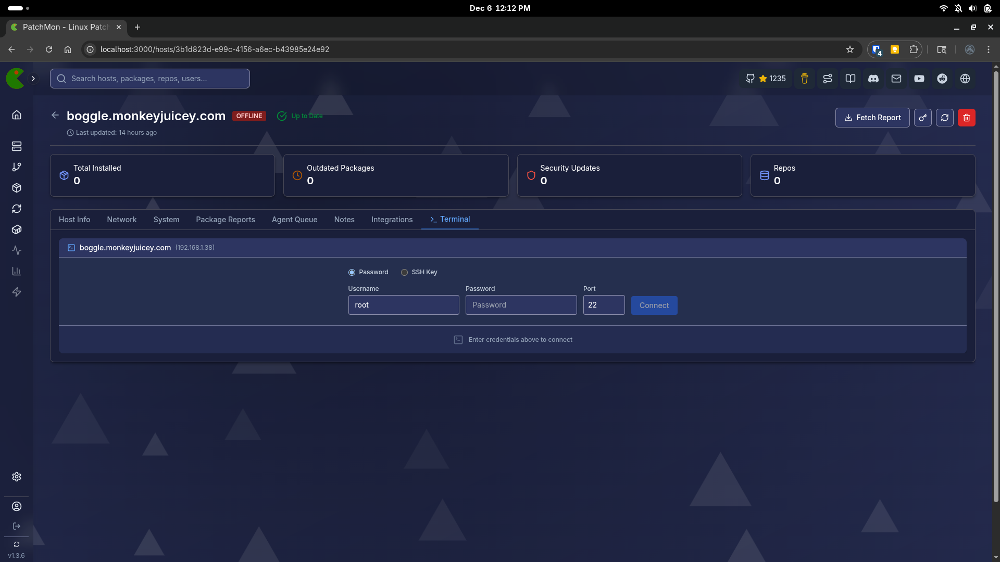
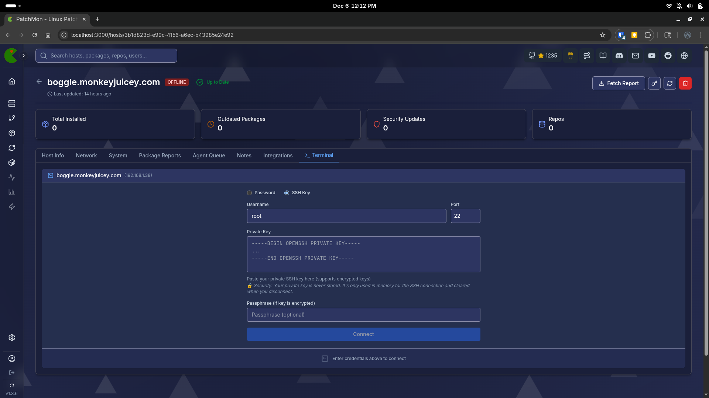
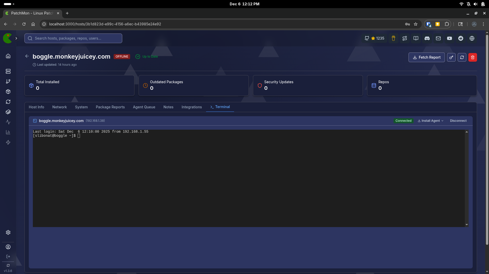

# How to Add Screenshots to Your PR

## Quick Method (Recommended) - Drag & Drop

1. **Take screenshots** of your SSH terminal feature:
   - SSH Terminal modal with connection form
   - Active SSH terminal session
   - Embedded mode on HostDetail page
   - Authentication method selection (password vs SSH key)

2. **Go to GitHub PR page** (create or edit your PR)

3. **In the PR description editor**, simply **drag and drop** your screenshot images

4. GitHub will automatically:
   - Upload the images
   - Generate the markdown image syntax
   - Insert it into your description

5. **That's it!** No need to commit images to the repo.

## Alternative Method - Add to Repository

If you prefer to keep screenshots in the repository:

1. **Save your screenshots** to `docs/images/ssh-terminal/`:
   ```bash
   # Create directory (already created)
   mkdir -p docs/images/ssh-terminal
   
   # Add your screenshots
   # Name them descriptively:
   # - ssh-terminal-modal.png
   # - ssh-terminal-connected.png
   # - ssh-terminal-embedded.png
   # - ssh-terminal-auth-methods.png
   ```

2. **Commit them**:
   ```bash
   git add docs/images/ssh-terminal/*.png
   git commit -m "Add: SSH Terminal feature screenshots"
   git push fork feature/ssh-terminal-access
   ```

3. **Reference in PR description**:
   ```markdown
   
   ```

## Recommended Screenshots

1. **Connection Form** - Show the modal with username/password fields
2. **Active Terminal** - Show a working SSH session with terminal output
3. **Embedded Mode** - Show terminal integrated into HostDetail page
4. **Auth Methods** - Show the toggle between password and SSH key authentication
5. **Error Handling** - Show error messages (optional but helpful)

## Image Guidelines

- **Format**: PNG or JPG
- **Size**: Keep under 2MB each (GitHub limit)
- **Dimensions**: 1200-1920px width is good for readability
- **Naming**: Use descriptive names like `ssh-terminal-modal.png`

## Example PR Description Section

```markdown
## Screenshots

### SSH Terminal Modal View


### Active SSH Connection  


### Embedded Mode

```

## Tips

- **Annotate if needed**: Use arrows or text overlays to highlight key features
- **Show different states**: Connection form, connected, error states
- **Keep it clean**: Crop to show only relevant UI elements
- **Multiple views**: Show both modal and embedded modes if applicable
